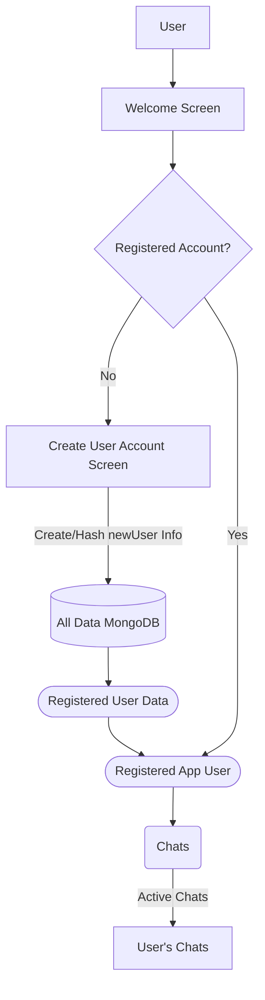

```mermaid
flowchart TD
%% Nodes
    A[(All Data MongoDB)] 
    A-->W([Registered User Data])--> B([Registered App User])
    B--> C(Chats)
    C--Active Chats-->D[User's Chats]

    Y[Welcome Screen]

    U[User]
    U-->Y

    Y-->G{Registered Account?}
    G--Yes-->B
    G--Noo-->Z[Create User Account Screen]
    Z--Create/Hash newUser Infoo-->A
```

Notes:

Every chat will create a new cluster/collection/object of all the users active chats